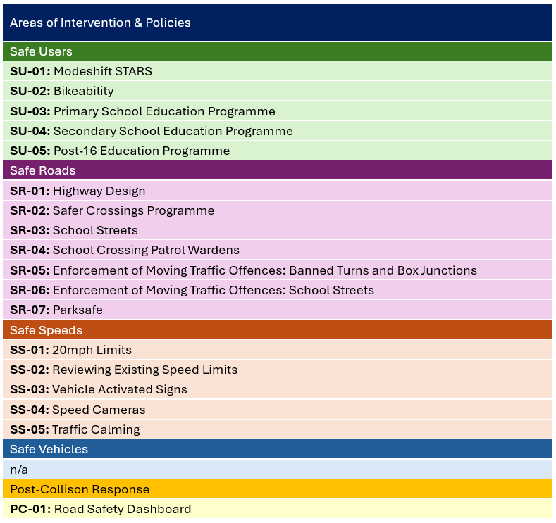

## People  

Laurie Platt, Data Scientist, is in the final year of an [Advanced Data Fellowship Multiverse course](https://www.multiverse.io/employers/programmes/advanced-data-fellowship). For his current [Business Transformation Proposal module](https://sccextranet.sharepoint.com/:w:/r/sites/DataScience/Shared%20Documents/Public/RoadSafety/Multiverse/Module05-ProjectMgt/ADF_M5_Project_LauriePlatt.docx?d=w30acc46970554540b358c73b32d59556&csf=1&web=1&e=ma6JQc) (deadline 10/06/26) he's proposing a Traffic Collision Risk Model that could be undertaken for his Capstone Project (deadline Feb '27).  

Nicola Mchugh, the Performance & Insight Manager, is Laurie's line manager and has been involved in early discussions about the project.   

Tracy Hendry, the Road Safety Manager, has confirmed her interest in the project. Tracy wrote the current [Road Safety Action Plan 2024-29](https://sccextranet.sharepoint.com/:b:/r/sites/DataScience/Shared%20Documents/Public/RoadSafety/Background/SCC%20Road%20Safety%20Action%20Plan%202024%20-%202029.pdf?csf=1&web=1&e=tz4ZeN).  

Ian Woodhouse, Principal Transport Planner, is writing the [emerging Road Safety Strategy](https://sccextranet.sharepoint.com/:w:/r/sites/DataScience/Shared%20Documents/Public/RoadSafety/Background/260323_Road%20Safety%20Strategy_V10.docx?d=we5c48ad9520d4953b354c53ef6700de9&csf=1&web=1&e=jiniSw) due autumn 2026.      

Ashley Carnall, Road Safety Auditor, is analysing data to identify the most dangerous roads that require an engineering scheme to improve them.  

Richard Whitely, the Transport Programmes Manager, is responsible for overseeing the [Road Safety Fund Programme](https://democracy.sheffield.gov.uk/mgIssueHistoryHome.aspx?IId=48150&optionId=0). This includes working with Members of the [Transport, Regeneration and Climate Policy Committee](https://democracy.sheffield.gov.uk/mgCommitteeDetails.aspx?ID=645) to agree which schemes are included in the programme.

Ben King, the Strategic Transport Manager, is Tracy and Ian's line manager, and maintains Project Mandates for each Road Safety scheme.   

People mentioned are highlighted in the diagram below, which illustrates where they sit in the Council structure.  

```{mermaid}
%%| label: people
%%| fig-cap: "Figure: People & Services"
%%| echo: true
%%| code-fold: hide

flowchart TD

    Top1[Kate Josephs - Chief Exec]
    Top2[Kate Martin<br/>City Futures - Exec Director]
    Top3[Parveen Akhtar<br/>Chief Operating Officer]
    
    Transport1["William Stewart<br/>Investment, Climate Change, & Planning - Director"]
    Transport2["Jefferson Nwokeoma<br/>Transport - Assistant Director"]

    Safety1["Ben King<br/>Strategic Transport - Manager"]:::yellow
    Safety2["Tracy Hendry<br/>Road Safety - Manager"]:::yellow 
    Safety3["Ian Woodhouse<br/>Transport Planner"]:::yellow 
    Projects1["Andrew Butler<br/>Transport Projects - Manager"]
    Projects2["Ashley Carnall<br/>Road Safety Auditor"]:::yellow 
    Programmes1["Richard Whiteley<br/>Transport Programmes - Manager"]:::yellow 

    Data1["Jonathon Clifton<br/>Strategy, Performance, & Communications - Director"]
    Data2["James Ford<br/>Chief Data Officer"]
    Data3["Nicola Mchugh<br/>Corporate Performance & Insight - Manager"]:::yellow
    Data4["Laurie Platt<br/>Data Scientist"]:::yellow 
    
    Top1 --> Top2
    Top1 --> Top3

    Top2 --> Transport1 --> Transport2
    Transport2 --> Safety1
    Safety1 --> Safety2
    Safety1 --> Safety3
    Transport2 --> Projects1 --> Projects2
    Transport2 --> Programmes1
    
    Top3 --> Data1 --> Data2 --> Data3 --> Data4

    classDef yellow fill:#FFF2CC
```

## Scope  

The Collision Risk Model project is initially a PoC (Proof of Concept) only. There is an existing process for prioritising interventions, and the PoC will be tested in parallel with this.    

The [emerging Road Safety Strategy](https://sccextranet.sharepoint.com/:w:/r/sites/DataScience/Shared%20Documents/Public/RoadSafety/Background/260323_Road%20Safety%20Strategy_V10.docx?d=we5c48ad9520d4953b354c53ef6700de9&csf=1&web=1&e=jiniSw) provides the summary below of Road Safety interventions and policies.  

{#fig-interventions .lightbox}

The scope of the PoC Collision Risk Model is SR-01 Highway Design only i.e. local Road Safety engineering schemes. It is arguable that a Collision Risk Model could inform, to a great or lesser extent, all of the listed interventions, and this is something that could be reviewed after the PoC.  

## Decision Process

### As-is spots 

```{mermaid}
%%| label: gap-analysis
%%| fig-cap: "Figure: As-is (spots) decision process"
%%| echo: true
%%| code-fold: hide

flowchart TD

    Analysis1["STATS19 on AccsMap<br/><b>hot-spot</b> analysis<br/>(<i>Officer</i>)"]
    Analysis2["Investigation of individual<br/><b>spots</b><br/>(<i>Officer</i>)"]
    Analysis3["Local Safety schemes<br/><b>scoring</b><br/>(<i>Officer</i>)"] 
    Criteria1["Local Safety schemes<br/><b>criteria</b><br/>(<i>Members</i>)"] 
    List1["Local Safety schemes<br/><b>draft priority list</b><br/>(<i>Officer</i>)"]
    List2["Local Safety schemes<br/><b>recommended priority list</b><br/>(<i>Manager</i>)"]
    List3["Local Safety schemes<br/><b>agreed priority list</b><br/>(<i>Members</i>)"]
    Programme1["Road Safety Fund<br/><b>Programme</b><br/>(<i>Officer</i>)"]
    
    Criteria1 --> Analysis3
    Analysis1 --> List1
    Analysis2 --> List1
    Analysis3 --> List1
    List1 --> List2 --> List3 --> Programme1
```

### As-is lengths    

```{mermaid}
%%| label: gap-analysis
%%| fig-cap: "Figure: As-is (lengths) decision process"
%%| echo: true
%%| code-fold: hide

flowchart TD

    AnalysisAccsmap["STATS19 on AccsMap<br/><b>eyeball</b> analysis<br/>(<i>Officer</i>)"]
    AnalysisExcel["In depth analysis<br/>of 42 lengths<br/><b>Excel</b><br/>(<i>Officer</i>)"] 
    Narrative["<b>Collision Risk Narrative</b><br/>for 5 projects<br/>(<i>Officer</i>)"]
    Mandate["<b>Project Mandate</b><br/>for 5 projects<br/>(<i>Manager</i>)"]

    ListInvestigation["Lengths (approx. 1km)<br/>of all A, B, & C roads<br/><b>Investigation List</b> of ??<br/>(<i>Officer</i>)"]:::yellow  
    ListPriorities["Local Safety schemes<br/><b>Draft Priority List</b> of 42<br/>(<i>Officer</i>)"]:::yellow
    ListProjectsDraft["Local Safety schemes<br/><b>Recommended Project List</b> of 5<br/>(<i>Manager</i>)"]:::yellow
    ListProjectsAgreed["Local Safety schemes<br/><b>Agreed Project List</b> of 5 <br/>(<i>Members</i>)"]:::yellow
    ListProgramme["Road Safety Fund<br/><b>Programme List</b> of 5<br/>(<i>Manager</i>)"]:::yellow
    
    AnalysisAccsmap --> ListInvestigation
    ListInvestigation --> ListPriorities
    ListPriorities --> ListProjectsDraft
    ListPriorities --> AnalysisExcel 
    AnalysisExcel --> ListProjectsDraft
    AnalysisExcel --> Narrative
    AnalysisExcel --> Mandate
    Narrative --> Mandate
    ListProjectsDraft --> ListProjectsAgreed
    Mandate --> ListProjectsAgreed
    ListProjectsAgreed --> ListProgramme

    classDef yellow fill:#FFF2CC
```

### To-be lengths

## Data Analysis Process

### As-is lengths  

### To-be lengths 


